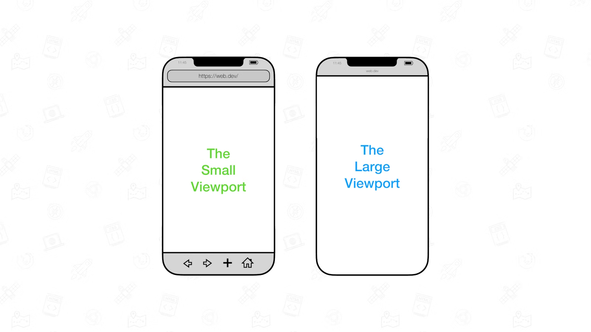

<h1 align="center">移动端适配碎碎念</h1>

# 为什么

px是很常用的单位，但px到底有多大？它等于屏幕上的一个物理像素吗？

[w3.org](https://www.w3.org/Style/Examples/007/units.zh_CN.html)给出的解释如下：

- 在打印机上，1 inch = 96px
- 在屏幕上，一根能清晰显示的最细的直线，其宽度为1px

<aside>
📱 怎么才算清晰显示，由设备决定。例如，

- iPhone 12 Pro 屏幕横向有1170像素，逻辑宽度390px
- iPhone SE 2 屏幕横向有750像素，逻辑宽度375px
</aside>

假设有这样一个元素：

在屏幕宽度为375px的设计稿上，宽度为40px

那么在屏幕宽度为390px的设备上，则应为41.6px

$$
\frac{x}{40} = \frac{390}{375}, x = 41.6
$$

当设备宽度和设计稿宽度不一致的时候，就需要进行等比例缩放。

# 如何做

## rem方案

`rem`是一种相对单位，`1rem` 的长度会恒等于`html`元素的`font-size` 的属性值。

说白话就是，如果把`font-size`设置成`16px`，那么`1rem`就为`16px`，设置为`24px`，`1rem`就是`24px`，以此类推。

可以利用这个特性把设备逻辑宽度和根元素的字体关联起来。

使设备宽度不管为多少`px`，以`rem`表示时都为定值，比如`3.75rem`，核心代码如下：

```tsx
(function () {
  function changeRootFont() {
    const WIDTH = 375
    const clientWidth = document.documentElement.clientWidth
    document.documentElement.style.fontSize = `${clientWidth / WIDTH * 100}px`
    // document.documentElement.style.fontSize = `${clientWidth / 10}px`
  }
  changeRootFont()
  window.addEventListener("resize", changeRootFont, false)
})()
```

编写CSS代码时，把`40px`则写成`0.4rem`，则可以实现等比例缩放。

### 缺陷

- 修改了根元素的`font-size` 破坏语义。

[参考](https://zhuanlan.zhihu.com/p/339554395)

## viewport方案

viewport就是Web内容可以被看见的窗口区域。[MDN](https://developer.mozilla.org/en-US/docs/Web/HTML/Viewport_meta_tag) 

可以不严谨地把它理解为一块有宽高的虚拟画布，先在画布上绘制内容，然后根据画布和缩放比显示在屏幕上。

根据这个[帖子](https://webplatform.github.io/docs/tutorials/mobile_viewport/)和测试的结果，移动浏览器的默认行为应该是设置画布为`980px`和不会产生横向滚动的缩放比。

它的宽度可以设置为定值，当然在1倍缩放比下，设置超过了设备宽度的值会导致横向滚动。

viewport方案就是把viewport宽度固定为设计稿宽度，然后把缩放比调成设备宽度和设计稿宽度的比例。

```html
<head>
	<!-- ... -->
	<meta name="viewport" content="width={设计稿宽度}, initial-scale={屏幕逻辑像素宽度/设计稿宽度}" >
</head>
```

```jsx
(function () {
  function adjustScale() {
    const WIDTH = 375
    let scale= screen.width/WIDTH
    let content= `width=${WIDTH}, initial-scale=${scale}, maximum-scale=${scale}, minimum-scale=${scale}`
    let meta= document.querySelector('meta[name=viewport]')
    if(!meta) {
        meta= document.createElement('meta')
        meta.setAttribute('name', 'viewport')
        document.head.appendChild(meta)
    }
    meta.setAttribute('content', content)
  }
  adjustScale()
  window.addEventListener("resize", adjustScale, false)
})()
```

### 缺陷

- 1px边框会变粗

[参考](https://zhuanlan.zhihu.com/p/339303865)

## vw方案

CSS有一些和viewport相关的单位，如果令viewport宽度为设备宽度，viewport的1%就相当于设备宽度的1%

- `vw(Viewport's width)`：`1vw`等于视觉视口的`1%`
- `vh(Viewport's height)` :`1vh` 为视觉视口高度的`1%`
- `vmin` : `vw` 和 `vh` 中的较小值
- `vmax` : 选取 `vw` 和 `vh` 中的较大值

其实上面rem方案可以看作是对它的一种模拟，以兼容2013年以前的浏览器。（[兼容性](https://caniuse.com/?search=vw)）

使用CSS的`calc()`或者Sass这样的预处理器，就可以把px转换成vw单位。

```scss
:root {
  --ratio: calc(100vw/750);
}
.button {
  font-size: calc(100vw*28/750);  /* 可以直接用calc */
  line-height: calc(100vw*48/750);
  
  width: calc(120*var(--ratio));  /* 也可以用calc配合var使用，IE不支持var */     
  border: 1px solid #000; /*不需要缩放的部分用px*/
  text-align: center;
}

@function px2vw($px) {
  @return $px * 100vw / 750;
}
.button {
  width: px2vw(120);
  font-size: px2vw(28);
  line-height: px2vw(48);
  border: 1px solid #000;
  text-align: center;
}
```

[参考](https://zhuanlan.zhihu.com/p/340299974)

### postcss改进版

因为`px`是非常直观的单位，我们可以手写`px`，让`postcss`帮忙编译成`vw`

```bash
yarn add -D postcss-px-to-viewport
```

配置示例如下，更多选项可以参考https://github.com/evrone/postcss-px-to-viewport

```jsx
// postcss.config.cjs

module.exports = {
    plugins: {
        'postcss-px-to-viewport': {
            unitToConvert: 'px',
            viewportWidth: 375,
            unitPrecision: 5,
            propList: ['*', "!border"],
            viewportUnit: 'vw',
        }
    },
}
```

## viewport演进

### vh的局限性

1. 很多浏览器，在计算 `100vh` 的高度的时候，会把地址栏等相关控件的高度计算在内
2. 同时，很多时候，由于会弹出软键盘等操作，在弹出的过程中，`100vh` 的计算值并不会实时发生变化！

为了解决上述的问题，规范新推出了三类单位，分别是：

1. The large viewport units（大视口单位）：`lvw`,`lvh`, `lvi`, `lvb`, `lvmin`, and `lvmax`
2. The small viewport units（小视口单位）：`svw`, `svh`, `svi`, `svb`, `svmin`, and `svmax`
3. The dynamic viewport units（动态视口单位）：`dvw`, `dvh`, `dvi`, `dvb`, `dvmin`, and `dvmax`

我们需要先知道什么是lsd三种viewport：

1. 大视口（Large Viewport）：视口大小假设任何动态扩展和缩回的 UA 界面都没有展开
2. 小视口（Small Viewport）：视口大小假设任何动态扩展和缩回的 UA 界面都展开了
3. 动态视口（Dynamic Viewport）
    1. 动态工具栏展开时，动态视口等于小视口的大小
    2. 当动态工具栏被缩回时，动态视口等于大视口的大小



结论：**全面使用 dvh 替代 vh，能有效的减少非常多因为 vh 在移动端的表现而引起的问题**。

[参考](https://github.com/chokcoco/iCSS/issues/223)